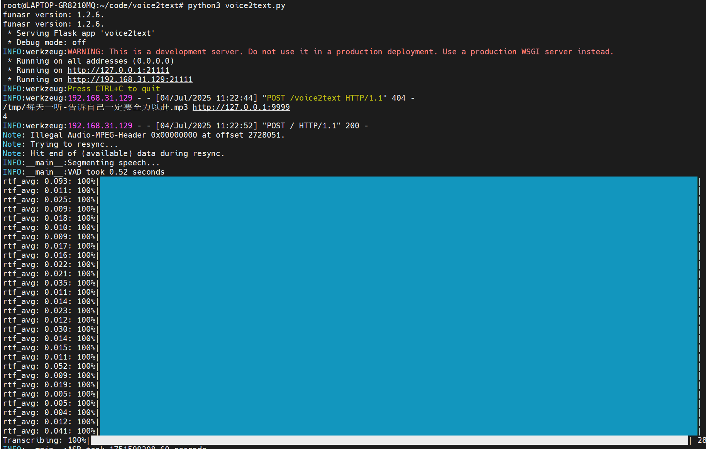
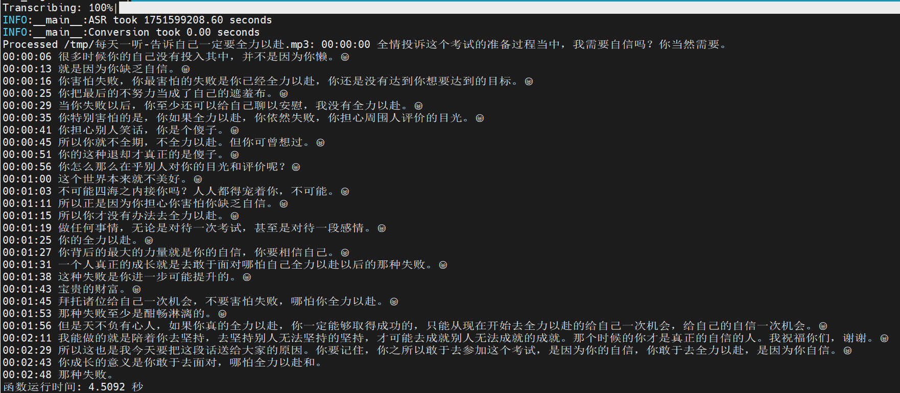

# Voice2text

## 介绍

本项目使用阿里开源的SenseVoiceSmall模型实现声音转文字功能。

- flask web api，提供http接口接收音频文件（目前不接收视频，你需要提取音频发过来）并进行字幕转化；也可以不提交文件，而是提交一个本地音频文件路径，程序会读取本地文件进行转换，这适用于voice2text部署在本机的情况下，或是使用WSL部署的情况，可以直接用通过 /mnt/盘符/ （如访问d盘的文件： /mnt/d/1.mp3） 来访问Windows宿主机的文件。
- 生成格式为 ”`<时刻>:<说话内容>`“ 的字幕内容，方便用户查找感兴趣的视频段落进行播放。
- 实现了推送字幕内容到Trovelocal项目，以便为该知识库中的视频、音频添加正文内容，方便用户做全文检索。
- SenseVoice号称吊打openai的Whisper，速度极快，3分钟的视频只需要3秒钟，显存占用1G，我的三年前发布的拯救者的3050Ti也能轻松秒杀。

## 运行截图





## 接口说明

path：/

method: post

提交格式：多重表单

参数：

​	file_path	表示从本地文件路径去读取音频文件

​	uid	Trovelocal项目需要的数据库id

​	callback_path	表示字幕生成完毕后，提交到callback_url的哪个path。你也可以修改代理忽略这个，然后完整设置callback_url的值

​	content	音频文件内容，这是一个文件。如果上传文件则不应该指定file_path。


请求报文例子1（从本地音频文件生成字幕）：

```
POST / HTTP/1.1
User-Agent: PostmanRuntime/7.44.1
Accept: */*
Cache-Control: no-cache
Postman-Token: 4972f309-73ad-47b9-bc30-19e7fcd1080f
Host: 192.168.31.129:21111
Accept-Encoding: gzip, deflate
Connection: close
Content-Type: multipart/form-data; boundary=--------------------------218247848976014545537970
Content-Length: 461

----------------------------218247848976014545537970
Content-Disposition: form-data; name="file_path"

/tmp/每天一听-告诉自己一定要全力以赴.mp3
----------------------------218247848976014545537970
Content-Disposition: form-data; name="uid"

testuid
----------------------------218247848976014545537970
Content-Disposition: form-data; name="callback_path"

/voice_callback
----------------------------218247848976014545537970--

```

响应报文例子：

```
HTTP/1.1 200 OK
Server: Werkzeug/3.1.3 Python/3.10.12
Date: Fri, 04 Jul 2025 03:25:46 GMT
Content-Type: application/json
Content-Length: 45
Connection: close

{"status":"create task ok. wait for result"}

```


请求报文2（上传音频文件进行字幕生成）：

```
POST / HTTP/1.1
User-Agent: PostmanRuntime/7.44.1
Accept: */*
Cache-Control: no-cache
Postman-Token: ae5c34ce-c9cc-4691-9691-aebf67c63ff1
Host: 192.168.31.129:21111
Accept-Encoding: gzip, deflate
Connection: close
Content-Type: multipart/form-data; boundary=--------------------------159817337182647529882209
Content-Length: 2728716

----------------------------159817337182647529882209
Content-Disposition: form-data; name="uid"

testuid
----------------------------159817337182647529882209
Content-Disposition: form-data; name="callback_path"

http://127.0.0.1:9999
----------------------------159817337182647529882209
Content-Disposition: form-data; name="content"; filename="每天一听-告诉自己一定要全力以赴.mp3"; filename*=UTF-8''%E6%AF%8F%E5%A4%A9%E4%B8%80%E5%90%AC-%E5%91%8A%E8%AF%89%E8%87%AA%E5%B7%B1%E4%B8%80%E5%AE%9A%E8%A6%81%E5%85%A8%E5%8A%9B%E4%BB%A5%E8%B5%B4.mp3
Content-Type: audio/mpeg

xxxxxxxxxxxxxxxxxxx这里是二进制xxxxxxxxxxxxxxxxxxx
```


## 使用说明

建议在linux下运行，我是在ubuntu22.04运行，python版本3.10.12，其他环境请自测。

请下载项目Release中的model_save.tar.gz，并解压到项目目录下，解压后会产生model_save文件夹，里面是模型文件。

然后安装依赖库 pip install -r requirements.txt

修改voice2text.py脚本，如果你需要通过http提交字幕内容到外部系统，需要修改callback_url、bear_token或者报文格式等。

然后运行 python3 voice2text.py

运行后，默认监听在21111端口。

## 